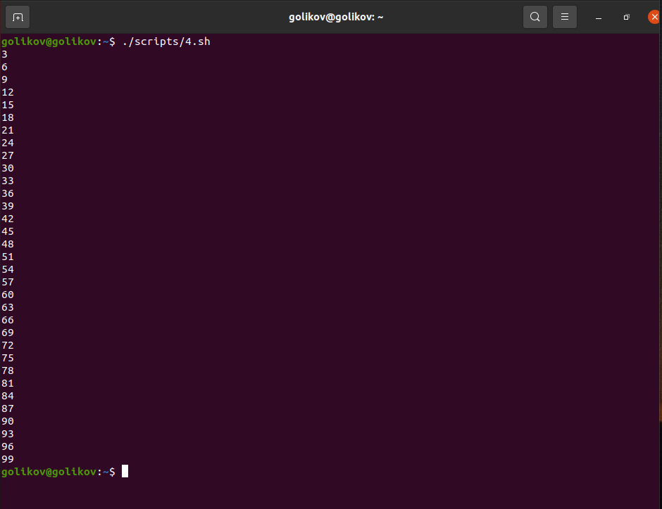
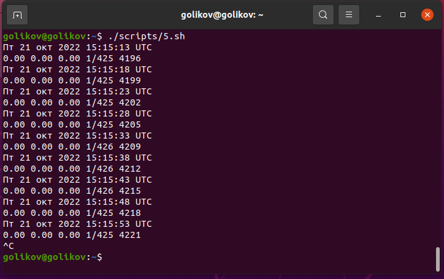
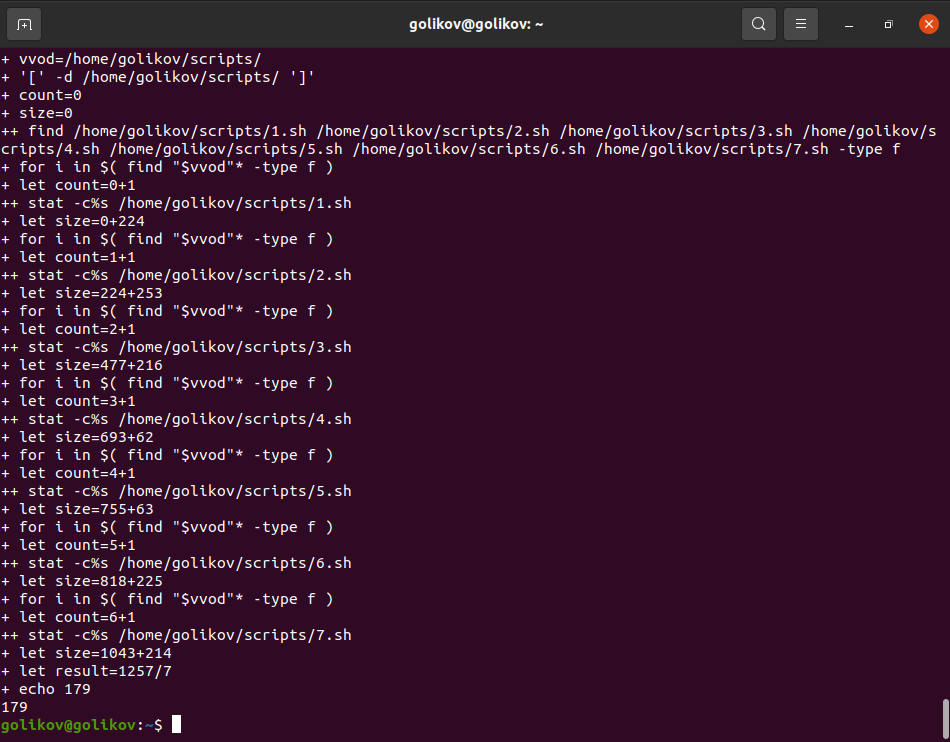

# Домашнее задание к занятию "5.2 Программирование на Bash. Циклы и функции." 

------

### Задание 1.

Напишите скрипт, который выводит на экран все числа от 1 до 100, которые делятся на 3.

*Пришлите получившийся код и скриншот, показывающий работу скрипта в качестве ответа.*
```
#!/bin/bash
i=3
for ((i=3; $i<=100; i=$i+3)) do
echo $i;
done
```



------

### Задание 2.

Напишите скрипт, который каждые 5 секунд будет выводить на экран текущее время и содержимое файла `/proc/loadavg`.

*Пришлите получившийся код и скриншот, показывающий работу скрипта в качестве ответа.*
```
#!/bin/bash
while true; do
date
cat /proc/loadavg
sleep 5
done
```



------

### Задание 3.

Напишите функцию для подсчета среднего размера файла в директории. 

 - путь к директории должен передаваться параметром, например `avgfile /home/username`;
 - функция должна проверять, что такая директория существует, подсчитывать и выводить на экран средний размер файла в ней;
 - при подсчете не нужно учитывать поддиректории и символьные ссылки, считать только средний размер файлов в заданной директории.

<details>
  <summary>Подсказка - Примерный алгоритм решения</summary>

  1. В скрипте объявите функцию. Поместите аргумент в переменную с понятным названием. Проверьте, существует ли заданная в аргументе директория с помощью if.

  2. Внутри функции объявите вспомогательные переменные. Одна переменная будет служить для сохранения суммы размеров всех файлов в директории, а другая будет содержать количество файлов.

  3. Для перебора файлов внутри директории используйте цикл for.

  4. Внутри цикла с помощью if проверяйте, является ли данный объект файлом.

  5. Если это файл, то к переменной суммы добавляйте размер файла и увеличивайте на один переменную с количеством файлов (получить размер одного файла можно с помощью `stat -c "%s" filename`).

  6. После выхода из цикла for (перебора всех файлов в директории), разделите значение переменной с суммой размеров файлов на количество этих файлов и выведите результат на экран.

  7. В конце скрипта, вызовите только что написанную функцию с аргументом, например `avgfile $1`

  8. Запускайте скрипт `./script3.sh /home/username` и смотрите результат. Если все работает, можно добавить данную функцию к себе в .bash_profile и использовать для работы.

</details>


*Пришлите получившийся код функции и скриншот, показывающий работу функции в качестве ответа.*
```
#!/bin/bash
set -x

vvod="$1"
if [ -d "$vvod" ]; then
 count=0
 size=o
for i in $( find "vvod"* -type f); do
  let count=$count+1
  let size=$size+$( stat -c%s $i )
 done
let result=$size/$count
echo $result
fi
```



------
